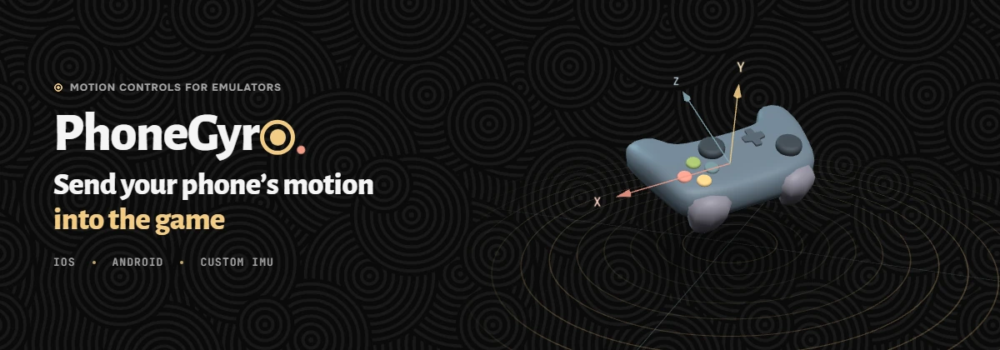
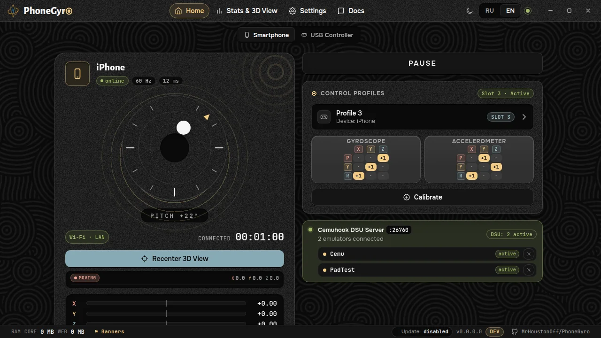
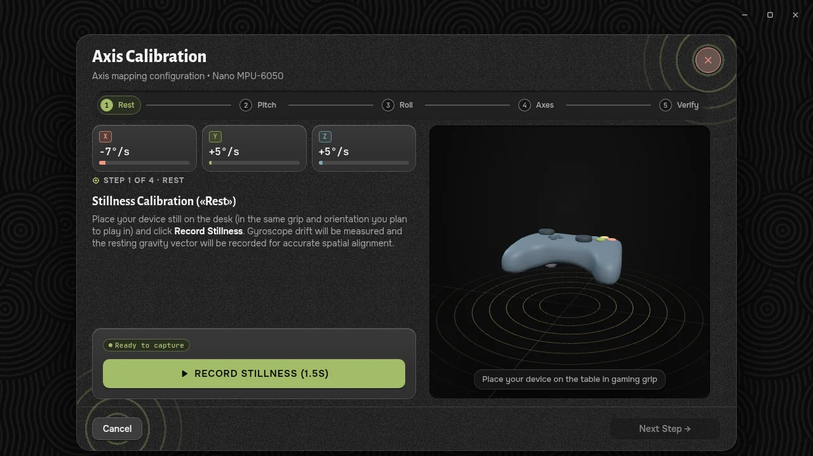
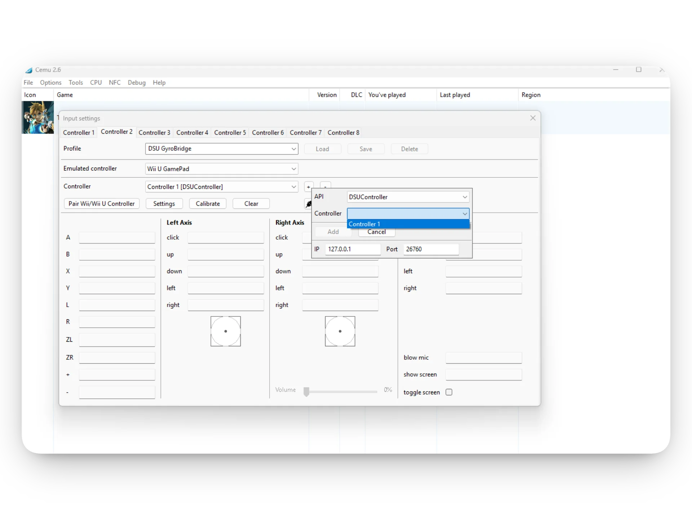
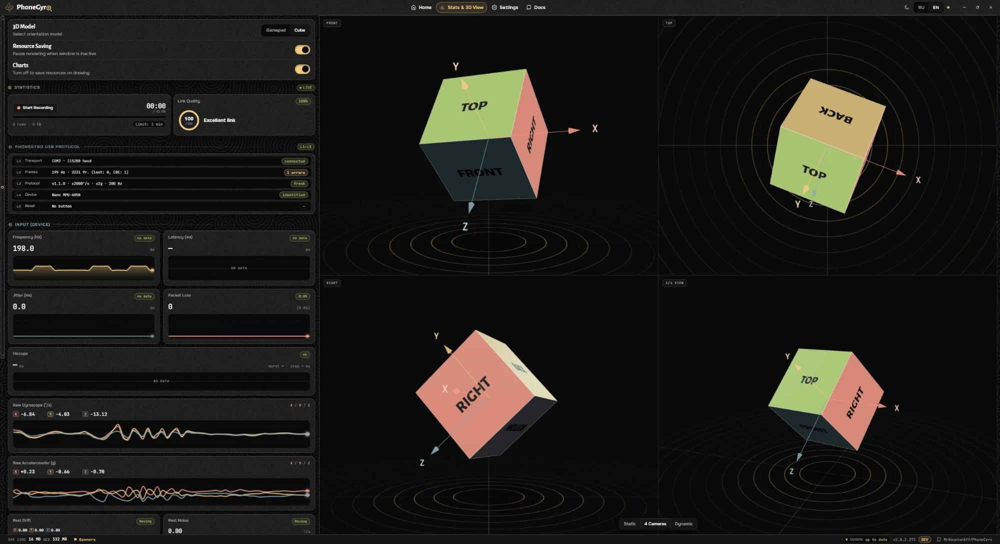
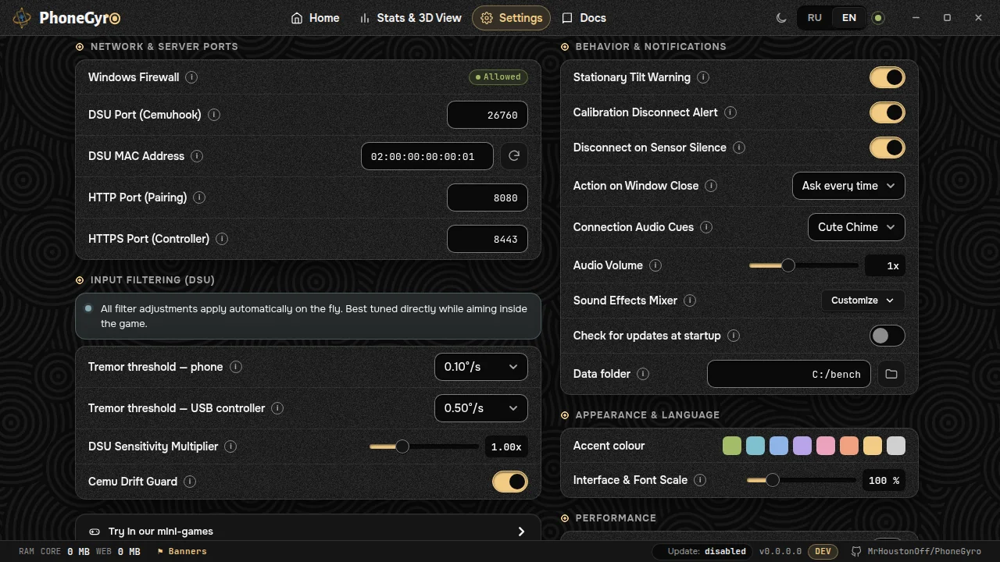

**English** | [Русский](docs/README_RU.md)

<p align="center">
  
</p>

<p align="center">
  <a href="https://github.com/MrHoustonOff/PhoneGyro/releases/latest"></a>
  <a href="https://github.com/MrHoustonOff/PhoneGyro/releases"></a>
  <a href="https://github.com/MrHoustonOff/PhoneGyro/stargazers"></a>
  
  
  <a href="LICENSE"></a>
  <a href="https://github.com/MrHoustonOff/PhoneGyro/actions/workflows/test.yml"></a>
</p>

<p align="center">
  <a href="https://github.com/MrHoustonOff/PhoneGyro/releases/latest"><b>Download</b></a>
  &nbsp;&middot;&nbsp;
  <a href="docs/SUMMARY.md"><b>Documentation</b></a>
  &nbsp;&middot;&nbsp;
  <a href="https://youtu.be/hDeGmq4bSp0"><b>Video</b></a>
</p>

PhoneGyro turns your computer into a server and your iPhone or Android phone into a motion source. You can stream your phone's gyroscope data to any client that supports the DSU (Cemuhook) protocol, emulators in the first place.

## Tested on

| Platform | Devices | Result |
|---|---|---|
| **iOS 26** | iPhone 13 Pro<br>iPhone 15<br>iPad 9 (2021) | full compatibility |
| **Android 11** | Redmi Note 9S | full compatibility |
| **Custom IMU** | MPU-6050 + Arduino Nano | full compatibility |

Compatible with Cemu, RPCS3, Ryujinx, Yuzu, Dolphin, PCSX2, and any game or tool supporting Cemuhook DSU.

## Video

<p align="center">
  <a href="https://youtu.be/hDeGmq4bSp0"></a>
</p>

> [!IMPORTANT]
> **Formerly GyroBridge.** Since v2.0.0 the project is called PhoneGyro. All GyroBridge v1.x releases are deprecated and considered highly unstable — use v2.0.0 or newer. There is no migration from v1.x: reinstall the certificate on iPhone/iPad and recalibrate. See the [v2.0.0 release notes](docs/RELEASE_NOTES.md).

---

## Quick start

### 1. Download
Download `PhoneGyro.exe` (or `PhoneGyro-windows-arm64.exe` for Windows on ARM) from [GitHub Releases](https://github.com/MrHoustonOff/PhoneGyro/releases/latest). There is no installer: the program is a single file.

### 2. Launch
Your phone and PC must be **on the same Wi-Fi network**. Launch `PhoneGyro.exe` and pick the source at the top of the window: **Smartphone** or **USB Controller**.

<p align="center">
  
</p>

### 3. Connect a device
- **iPhone and iPad:** open the **Initial Setup** tab in the app and go through six steps: Safari only exposes gyroscope data over HTTPS, so a local certificate is installed on the phone once. Then scan the QR code on the main screen.
- **Android:** scan the QR code with the camera and open the page in Chrome. On the "Your connection is not private" warning tap **Advanced**, then **Proceed**.
- **USB controller** (Arduino Nano + MPU-6050): flash the [reference firmware](https://github.com/MrHoustonOff/PhoneGyro_hardware_protocol) (protocol 1.1 or newer) and plug it in. PhoneGyro finds it on any COM port by itself.

On the phone, turn on **Touch Shield** right away: the screen will not go dark and stray touches will not break anything.

### 4. Calibrate: a mandatory step
Tap **Calibrate** and go through the wizard: four recording steps and a check, about a minute. Calibration tells PhoneGyro where "forward" and "right" are for your grip. **Without it the aim moves along the wrong axis or backwards.** Once per device and grip is enough; phone and USB controller profiles are stored separately.

<p align="center">
  
</p>

### 5. Set up the emulator
In your emulator's input settings add a DSU client:

| Parameter | Value |
|---|---|
| Server IP | `127.0.0.1` |
| Port | `26760` |
| Protocol | Cemuhook DSU |

<p align="center">
  
</p>

> [!TIP]
> While you play, hide PhoneGyro to the tray: the gyro keeps working and the load on your computer drops roughly 4 times.

Step-by-step instructions: [Quick start](docs/quickstart.en.md) and [Emulator setup](docs/emulators.en.md).

---

## What is inside

- **One server for any client.** Any client sees the Cemuhook DSU server on port `26760`. Connected emulators are shown by program name, and you can disconnect any of them right from the card.
- **Control profiles.** Six slots each for the phone and the USB controller, every profile with its own gyroscope and accelerometer matrices.
- **Live 3D view and statistics.** A gamepad model or a cube repeats your movements in four projections, next to gyroscope and accelerometer charts, rate, latency, jitter, packet loss and the USB protocol state.

<p align="center">
  
</p>

- **Tray and saving resources.** In the tray the UI is unloaded from memory while the gyro keeps working.
- **Tremor threshold.** Separate for the phone and the USB controller: the slowest movements near zero are flattened, ordinary aiming loses no speed. The rest of the motion is sent unsmoothed and drift-corrected ([motion pipeline](docs/motion-pipeline.en.md)).
- **Mini-games for testing.** Two games in settings let you feel the response before a real game.
- **Cemu Drift Guard.** A workaround for a known Cemu bug that makes the aim slowly drift.
- **Look and feel.** Dark and light themes, accent colour, interface scale (`Ctrl +`, `Ctrl -`, `Ctrl 0`), Russian and English, event sounds.

<p align="center">
  
</p>

---

## Documentation

The full guide is at [`docs/SUMMARY.md`](docs/SUMMARY.md). The same pages are built into the app (the **Docs** tab) and work offline.

| Section | What it covers |
|---|---|
| [Quick start](docs/quickstart.en.md) | From install to the game |
| [Connecting a phone](docs/phone.en.md) | The phone page, statuses, certificates |
| [USB controller](docs/usb.en.md) | The wired sensor |
| [Emulator setup](docs/emulators.en.md) | Cemu and other DSU clients |
| [Troubleshooting](docs/troubleshooting.en.md) | No connection, drift, firewall |
| [For developers](docs/dev.en.md) | Contributing, bug reports |

---

## Security, antivirus and transparency

PhoneGyro is free, open-source software under the MIT license. It has no telemetry, no data collection and no ads. All communication stays inside your local network between the PC and the phone. The only internet request the program can make is an optional update check: it is off by default and turned on in settings. Details: [Updates](docs/updates.en.md).

### Antivirus false positives
Independent open-source developers rarely buy a corporate code signing (EV) certificate: it costs hundreds of dollars a year. Without a commercial signature, the heuristics of some antivirus products (for example the `!ml` labels in Microsoft Defender) may wrongly flag `PhoneGyro.exe`.

We check releases against VirusTotal (69+ engines report the file clean). If you still have doubts:
- **Inspect the source.** Read the repository yourself or hand it to any AI assistant (ChatGPT, Claude, Gemini and others) for an independent audit.
- **Build it yourself.** Compile the binary on your own machine with Go and Wails (instructions below).

---

## Building from source

Prerequisites:
- [Go](https://go.dev/) 1.25+
- [Node.js](https://nodejs.org/) 18+
- [Wails CLI v2](https://wails.io) (`go install github.com/wailsapp/wails/v2/cmd/wails@latest`)

```bash
# Clone the repository
git clone https://github.com/MrHoustonOff/PhoneGyro.git
cd PhoneGyro/gui

# Build Windows x86_64
wails build -tags native_webview2loader -o PhoneGyro.exe

# Build Windows ARM64
wails build -tags native_webview2loader -platform windows/arm64 -o PhoneGyro-arm64.exe
```

The compiled binaries land in `gui/build/bin/`. Project layout, checks and code rules: [Contributing](docs/contributing.en.md).

---

## License

This project is open source and licensed under the [MIT License](LICENSE).
