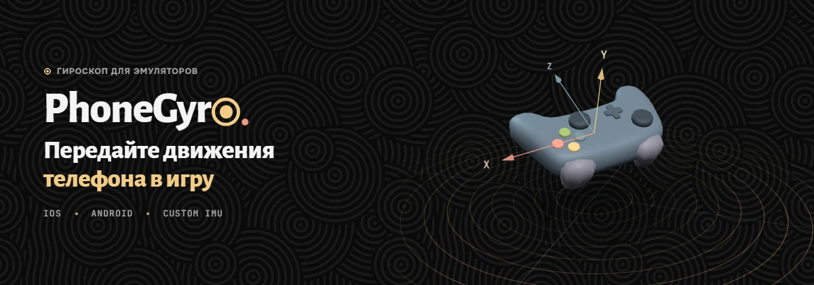

[English](../README.md) | **Русский**

<p align="center">
  
</p>

<p align="center">
  <a href="https://github.com/MrHoustonOff/PhoneGyro/releases/latest"></a>
  <a href="https://github.com/MrHoustonOff/PhoneGyro/releases"></a>
  <a href="https://github.com/MrHoustonOff/PhoneGyro/stargazers"></a>
  
  
  <a href="../LICENSE"></a>
</p>

<p align="center">
  <a href="https://github.com/MrHoustonOff/PhoneGyro/releases/latest"><b>Скачать</b></a>
  &nbsp;&middot;&nbsp;
  <a href="SUMMARY.md"><b>Документация</b></a>
  &nbsp;&middot;&nbsp;
  <a href="https://youtu.be/hDeGmq4bSp0"><b>Видео</b></a>
</p>

PhoneGyro превращает ваш компьютер в сервер, а ваш iPhone или Android-телефон в источник движения. Вы можете передавать данные гироскопа телефона в любой клиент, поддерживающий протокол DSU (Cemuhook), в первую очередь в эмуляторы.

## Протестировано на

| Платформа | Устройства | Результат |
|---|---|---|
| **iOS 26** | iPhone 13 Pro<br>iPhone 15<br>iPad 9 (2021) | максимальная совместимость |
| **Android 11** | Redmi Note 9S | максимальная совместимость |
| **Свой IMU-датчик** | MPU-6050 + Arduino Nano | максимальная совместимость |

Совместимо с Cemu, RPCS3, Ryujinx, Yuzu, Dolphin, PCSX2 и любыми играми и эмуляторами, поддерживающими протокол Cemuhook DSU.

## Видео

<p align="center">
  <a href="https://youtu.be/hDeGmq4bSp0"></a>
</p>

> [!IMPORTANT]
> **Раньше назывался GyroBridge.** С версии v2.0.0 проект называется PhoneGyro. Все релизы GyroBridge v1.x устарели и считаются крайне нестабильными — используйте v2.0.0 или новее. Переноса данных с v1.x нет: заново установите сертификат на iPhone/iPad и откалибруйте устройство. Подробности — в [заметках к релизу v2.0.0](RELEASE_NOTES.md).

## Быстрый старт

### 1. Скачайте
Скачайте `PhoneGyro.exe` (или `PhoneGyro-windows-arm64.exe` для Windows на ARM) со страницы [GitHub Releases](https://github.com/MrHoustonOff/PhoneGyro/releases/latest). Установка не нужна: программа состоит из одного файла.

### 2. Запустите
Телефон и ПК должны быть **в одной сети Wi-Fi**. Запустите `PhoneGyro.exe` и выберите источник вверху окна: **Смартфон** или **USB-контроллер**.

<p align="center">
  
</p>

### 3. Подключите устройство
- **iPhone и iPad:** откройте в приложении вкладку **Начальная настройка** и пройдите шесть шагов: Safari отдаёт данные гироскопа только по HTTPS, поэтому на телефон один раз ставится локальный сертификат. Затем отсканируйте QR-код на главном экране.
- **Android:** отсканируйте QR-код камерой и откройте страницу в Chrome. На предупреждение «Подключение не защищено» нажмите **Дополнительно**, затем **Перейти на сайт**.
- **USB-контроллер** (Arduino Nano + MPU-6050): прошейте [референсную прошивку](https://github.com/MrHoustonOff/PhoneGyro_hardware_protocol) (протокол 1.1 и новее) и воткните кабель. PhoneGyro сам найдёт его на любом COM-порту.

На телефоне сразу включите **Защиту от касаний**: экран не погаснет, а случайные касания ничего не сломают.

### 4. Откалибруйте: обязательный шаг
Нажмите **Калибровать** и пройдите мастер: четыре шага записи и проверка, около минуты. Калибровка сообщает PhoneGyro, где для вашего хвата «вперёд» и «вправо». **Без неё прицел двигается не по той оси или в обратную сторону.** Её достаточно сделать один раз на устройство и хват, профили телефона и USB-контроллера хранятся раздельно.

<p align="center">
  
</p>

### 5. Настройте эмулятор
В настройках управления эмулятора добавьте клиент DSU:

| Параметр | Значение |
|---|---|
| IP сервера | `127.0.0.1` |
| Порт | `26760` |
| Протокол | Cemuhook DSU |

<p align="center">
  
</p>

> [!TIP]
> Играя, сворачивайте PhoneGyro в трей: гироскоп продолжает работать, а нагрузка на компьютер падает примерно в 4 раза.

Подробные пошаговые инструкции: [Быстрый старт](quickstart.ru.md) и [Настройка эмулятора](emulators.ru.md).

---

## Что внутри

- **Один сервер для любых клиентов.** Сервер Cemuhook DSU на порту `26760` видит любой клиент. Подключённые эмуляторы показываются по имени программы, любой можно отключить прямо из карточки.
- **Профили управления.** По шесть слотов отдельно для телефона и USB-контроллера, у каждого профиля свои матрицы гироскопа и акселерометра.
- **Живой 3D-просмотр и статистика.** Модель геймпада или куб повторяет ваши движения в четырёх проекциях, рядом графики гироскопа и акселерометра, частота, задержка, джиттер, потери пакетов и состояние USB-протокола.

<p align="center">
  
</p>

- **Трей и экономия ресурсов.** В трее интерфейс выгружается из памяти, а гироскоп продолжает работать.
- **Порог дрожи.** Отдельно для телефона и USB-контроллера: самые медленные движения у нуля гасятся, обычное прицеливание не теряет скорость. Остальное движение передаётся без сглаживания и с коррекцией дрейфа ([пайплайн движения](motion-pipeline.ru.md)).
- **Мини-игры для проверки.** Две игры в настройках помогают почувствовать отклик перед настоящей игрой.
- **Защита от дрейфа в Cemu.** Обход известной ошибки Cemu, из-за которой прицел медленно уплывает.
- **Оформление.** Тёмная и светлая темы, цвет акцента, масштаб интерфейса (`Ctrl +`, `Ctrl -`, `Ctrl 0`), русский и английский языки, звуковые сигналы событий.

<p align="center">
  
</p>

---

## Документация

Полное руководство лежит в [`docs/SUMMARY.md`](SUMMARY.md). Те же страницы встроены в приложение (вкладка **Документация**) и работают офлайн.

| Раздел | О чём |
|---|---|
| [Быстрый старт](quickstart.ru.md) | Путь от установки до игры |
| [Подключение телефона](phone.ru.md) | Страница на телефоне, статусы, сертификаты |
| [USB-контроллер](usb.ru.md) | Проводной датчик |
| [Настройка эмулятора](emulators.ru.md) | Cemu и другие клиенты DSU |
| [Решение проблем](troubleshooting.ru.md) | Нет соединения, дрейф, брандмауэр |
| [Для разработчиков](dev.ru.md) | Участие в разработке, отчёты об ошибках |

---

## Безопасность, антивирусы и открытость

PhoneGyro полностью бесплатен и распространяется с открытым исходным кодом под лицензией MIT. В нём нет телеметрии, сбора данных и рекламы. Весь обмен данными идёт внутри вашей локальной сети между ПК и телефоном. Единственное обращение в интернет, которое программа может сделать, это необязательная проверка обновлений: по умолчанию она выключена и включается в настройках. Подробности: [Обновления](updates.ru.md).

### О ложных срабатываниях антивирусов
Независимые разработчики открытого ПО редко покупают корпоративный сертификат подписи кода (EV Code Signing): он стоит сотни долларов в год. Из-за отсутствия коммерческой подписи эвристические алгоритмы некоторых антивирусов (например, метки `!ml` у Microsoft Defender) могут ошибочно пометить `PhoneGyro.exe`.

Мы проверяем релизы на VirusTotal (69+ систем признают файл чистым). Если у вас остались сомнения:
- **Проверьте исходный код.** Изучите репозиторий сами или дайте его любому ИИ-ассистенту (ChatGPT, Claude, Gemini и др.) для независимого аудита.
- **Соберите программу сами.** Скомпилируйте бинарный файл на своём компьютере с помощью Go и Wails (инструкция ниже).

---

## Сборка из исходников

Требования:
- [Go](https://go.dev/) 1.25+
- [Node.js](https://nodejs.org/) 18+
- [Wails CLI v2](https://wails.io) (`go install github.com/wailsapp/wails/v2/cmd/wails@latest`)

```bash
# Клонирование репозитория
git clone https://github.com/MrHoustonOff/PhoneGyro.git
cd PhoneGyro/gui

# Сборка под Windows x86_64
wails build -tags native_webview2loader -o PhoneGyro.exe

# Сборка под Windows ARM64
wails build -tags native_webview2loader -platform windows/arm64 -o PhoneGyro-arm64.exe
```

Скомпилированные файлы появятся в `gui/build/bin/`. Структура проекта, проверки и правила кода: [Участие в разработке](contributing.ru.md).

---

## Лицензия

Проект распространяется с открытым исходным кодом под лицензией [MIT](../LICENSE).
