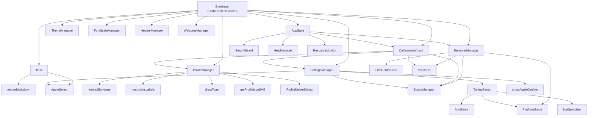

# Карта фронтенда PhoneGyro: Инвентаризация index.html и граф зависимостей

> **Статус документа:** Внутренняя архитектурная спецификация (Шаг 1 плана рефакторинга).  
> **Файл-источник:** [`gui/frontend/src/index.html`](file:///M:/00_Coding/00_Projects/iphone-gyro-controller/gui/frontend/src/index.html) (JavaScript: строки 2415–11480).  
> **Рабочая ветка:** `refactor/frontend` | **Точка отката (тег):** `pre-gemini` (`dd22aa8`).  
> **Базовое правило:** Рефакторинг строго без изменения поведения — пиксель-в-пиксель, логика 1-в-1.

---

## Содержание

1. [Введение и модель исполнения JavaScript](#1-введение-и-модель-исполнения-javascript)
2. [Сводная таблица верхнеуровневых компонентов (31 сущность + Bootstrap)](#2-сводная-таблица-верхнеуровневых-компонентов-31-сущность--bootstrap)
3. [Детальная спецификация компонентов](#3-детальная-спецификация-компонентов)
4. [Анализ графа зависимостей и порядок подключения скриптов](#4-анализ-графа-зависимостей-и-порядок-подключения-скриптов)
5. [Архитектура стилей (gui/frontend/src/main.css)](#5-архитектура-стилей-guifrontendsercmaincss)
6. [Поэтапный план рефакторинга (Шаги 2–6)](#6-поэтапный-план-рефакторинга-шаги-26)

---

## 1. Введение и модель исполнения JavaScript

Весь клиентский код главного окна в исходном состоянии сосредоточен внутри одного тега `<script>` в файле [`gui/frontend/src/index.html`](file:///M:/00_Coding/00_Projects/iphone-gyro-controller/gui/frontend/src/index.html) со строки 2415 по строку 11480 (всего **9 065 строк** чистого JavaScript, включая директиву `'use strict';` на строке 2416).

### 1.1 Архитектурные особенности и ограничения Wails v2
- **Классический контекст скрипта (Non-Module):** Все менеджеры объявлены через `const` или `function` на верхнем уровне скрипта. Они находятся в общей лексической области видимости документа, но **не создают свойств на объекте `window`** (за исключением явных присваиваний вроде `window._liveDebugWin`).
- **Запрет на `type="module"`:** Использование ES-модулей разорвёт прямую видимость между файлами без сложного экспорта/импорта, сделает невозможным вызов глобальных функций из инлайновых обработчиков и усложнит связывание с автогенерируемым мостом `wailsjs`. Поэтому при выносе кода будут использоваться исключительно классические теги `<script src="js/..."></script>`.
- **Строгий порядок загрузки:** Верхнеуровневые `const` из обычных скриптов подвержены эффекту Temporal Dead Zone (TDZ). Если скрипт `A` обратится к константе `B` в момент выполнения своего верхнеуровневого кода до того, как загружен скрипт `B`, возникнет `ReferenceError`. Все кросс-модульные вызовы в коде спроектированы внутри методов объектов и функций, которые активируются только на этапе `DOMContentLoaded` (в функции `startApp`). Тем не менее, сохранение исходного порядка подключения критически необходимо.
- **Взаимодействие с Go-бэкендом:**
  - Методы Go вызываются асинхронно через глобальный объект `window.go.main.App.<Метод>(...)`, возвращая `Promise`.
  - Системные события Wails слушаются через `window.runtime.EventsOn('<имя_события>', callback)`.
  - Внешние URL открываются через системный браузер: `window.runtime.BrowserOpenURL(url)`.

---

## 2. Сводная таблица верхнеуровневых компонентов (31 сущность + Bootstrap)

| № | Имя компонента | Тип | Строки (L) | Строк | Исходящие зависимости | Go-методы | Wails Events | Рекомендуемый файл |
|---|---|---|---|---|---|---|---|---|
| 1 | `renderMarkdown` | `function` | 2419–2454 | 36 | — | — | — | `js/utils/markdown.js` |
| 2 | `ThemeManager` | `const` | 2456–2521 | 66 | NetSparkline, PlatformGame, TuningBench, Scene3D | SetTheme | theme-sync | `js/theme.js` |
| 3 | `FontScaleManager` | `const` | 2523–2635 | 113 | HeaderManager, I18n, showToast | SetFontScale | font-scale-sync | `js/font-scale.js` |
| 4 | `HeaderManager` | `const` | 2637–2659 | 23 | — | — | — | `js/header.js` |
| 5 | `I18n` | `const` | 2661–2782 | 122 | renderMarkdown, AppleSelect, SetupWizard, ProfileManager, CalibrationWizard, AppState | GetTranslations, SetLang, GetLang | lang-sync | `js/i18n.js` |
| 6 | `initFooterVersion` | `async function` | 2785–2795 | 11 | — | GetAppVersion | — | `js/utils/version.js` |
| 7 | `formatSlotName` | `function` | 2797–2803 | 7 | I18n | — | — | `js/utils/formatters.js` |
| 8 | `matrixAxisLabels` | `function` | 2805–2815 | 11 | — | — | — | `js/utils/formatters.js` |
| 9 | `showToast` | `function` | 2817–2827 | 11 | — | — | — | `js/ui/toast.js` |
| 10 | `showAppleConfirm` | `function` | 2829–2879 | 51 | — | — | — | `js/ui/confirm.js` |
| 11 | `AppleCloseDialog` | `const` | 2881–2992 | 112 | I18n | ConfirmCloseChoice | app:confirm-close | `js/ui/close-dialog.js` |
| 12 | `ProfileDeleteDialog` | `const` | 2994–3062 | 69 | I18n, showToast | — | — | `js/ui/profile-delete-dialog.js` |
| 13 | `AppleSelect` | `const` | 3064–3325 | 262 | FontScaleManager, I18n | — | — | `js/ui/apple-select.js` |
| 14 | `setupCopyChip` | `function` | 3327–3350 | 24 | I18n | — | — | `js/ui/copy-chip.js` |
| 15 | `SetupWizard` | `const` | 3352–3532 | 181 | renderMarkdown, I18n, setupCopyChip, HelpManager, SettingsManager, WelcomeManager, AppState | — | — | `js/wizards/setup-wizard.js` |
| 16 | `HelpManager` | `const` | 3534–3619 | 86 | SetupWizard, SettingsManager, WelcomeManager, AppState | — | — | `js/ui/help-modal.js` |
| 17 | `SoundManager` | `const` | 3621–4020 | 400 | SettingsManager | PlaySystemSound | — | `js/audio/sound-manager.js` |
| 18 | `NetSparkline` | `const` | 4022–4117 | 96 | SettingsManager | — | — | `js/ui/net-sparkline.js` |
| 19 | `AimGame` | `const` | 4119–4562 | 444 | I18n, SoundManager, TuningBench | — | — | `js/games/aim-game.js` |
| 20 | `PlatformGame` | `const` | 4564–5573 | 1010 | I18n, SoundManager | ResetAHRS | — | `js/games/platform-game.js` |
| 21 | `TuningBench` | `const` | 5575–6327 | 753 | I18n, NetSparkline, AimGame, PlatformGame, RecenterManager, AppState | — | tuning:frame, device:disconnected, device:connected | `js/tuning/tuning-bench.js` |
| 22 | `SettingsManager` | `const` | 6329–7592 | 1264 | ThemeManager, FontScaleManager, I18n, showToast, showAppleConfirm, AppleSelect, SetupWizard, HelpManager, SoundManager, AimGame, PlatformGame, TuningBench, WelcomeManager, AppState | RegenerateDSUMAC, SetTuningFilterParams, GetAppSettings, SetTuningActive, SaveAppSettings | — | `js/settings/settings-manager.js` |
| 23 | `WelcomeManager` | `const` | 7594–7680 | 87 | SetupWizard, HelpManager, SettingsManager, AppState | MarkFirstLaunchDone, IsFirstLaunch | — | `js/wizards/welcome-modal.js` |
| 24 | `getProfileIconSVG` | `function` | 7682–7705 | 24 | — | — | — | `js/utils/profile-icons.js` |
| 25 | `ProfileManager` | `const` | 7707–7971 | 265 | I18n, formatSlotName, matrixAxisLabels, showToast, ProfileDeleteDialog, getProfileIconSVG, CalibrationWizard | SetActiveProfile | — | `js/profiles/profile-manager.js` |
| 26 | `RecenterManager` | `const` | 7973–8401 | 429 | I18n, formatSlotName, showToast, SoundManager, PlatformGame, TuningBench, getProfileIconSVG, ProfileManager, Scene3D, FirstCenterGate, AppState | ResetAHRS | ahrs:quat, link:loss, recenter:triggered | `js/recenter/recenter-manager.js` |
| 27 | `Scene3D` | `const` | 8403–8843 | 441 | — | — | — | `js/viewport/scene3d.js` |
| 28 | `CalibrationWizard` | `const` | 8845–10321 | 1477 | renderMarkdown, I18n, formatSlotName, showToast, SoundManager, SettingsManager, getProfileIconSVG, ProfileManager, Scene3D, AppState | StopCapture, ClearPreview, PreviewMatrix, ResetAHRS, StartAxisAlign, StartCapture, ValidateCalibration, GetAxisAlignStatus, SaveProfile, SetActiveProfile, CopyCalibrationReport | — | `js/wizards/calibration-wizard.js` |
| 29 | `FirstCenterGate` | `const` | 10323–10351 | 29 | SetupWizard, HelpManager, SettingsManager, WelcomeManager, RecenterManager, CalibrationWizard, AppState | — | — | `js/recenter/first-center-gate.js` |
| 30 | `AppState` | `const` | 10353–11383 | 1031 | renderMarkdown, I18n, setupCopyChip, SetupWizard, HelpManager, SoundManager, NetSparkline, PlatformGame, SettingsManager, WelcomeManager, ProfileManager, RecenterManager, Scene3D, CalibrationWizard, FirstCenterGate | SetInputMode, TogglePause, OpenLiveDebugWindow, GetState, GetInputMode, GetDSUStatus | state:change, device:connection-lost, device:connected, device:disconnected, device:visibility, dsu:status, input-mode-changed | `js/app-state.js` |
| 31 | `ResourceMonitor` | `const` | 11385–11432 | 48 | — | GetResourceStats | resource-stats | `js/ui/resource-monitor.js` |
| 32 | `Bootstrap` | `DOMContentLoaded listener` | 11434–11479 | 46 | ThemeManager, FontScaleManager, HeaderManager, I18n, initFooterVersion, AppleCloseDialog, AppleSelect, SetupWizard, HelpManager, NetSparkline, SettingsManager, WelcomeManager, ProfileManager, RecenterManager, CalibrationWizard, AppState, ResourceMonitor | — | — | `js/bootstrap.js` |

---

## 3. Детальная спецификация компонентов

### 3.1 `renderMarkdown` (function)
- **Диапазон в `index.html`:** строки `2419–2454` (36 строк)
- **Целевой модуль:** `js/utils/markdown.js`
- **Назначение:** Быстрый XSS-безопасный парсер подмножества Markdown: экранирование HTML (<, >, &), преобразование ссылок [text](url) с открытием через `window.runtime.BrowserOpenURL`, жирного текста **bold**, инлайнового кода `code` и списков.
- **Методы и свойства:** Единая функция или процедура
- **Исходящие зависимости (кого вызывает):** Нет (автономный модуль)
- **Вызовы Go Backend:** Нет
- **Слушатели Wails Events:** Нет
- **Ключевые DOM ID / Селекторы:** Не привязаны к конкретным статическим ID
- **Подводные камни и архитектурные нюансы:**
  > [!IMPORTANT]
  > Использует `window.runtime.BrowserOpenURL` для кликов по внешним ссылкам. Не должен бросать исключений на null/undefined.

### 3.2 `ThemeManager` (const)
- **Диапазон в `index.html`:** строки `2456–2521` (66 строк)
- **Целевой модуль:** `js/theme.js`
- **Назначение:** Управление глобальной цветовой темой интерфейса (dark/light). Устанавливает атрибут `data-theme` на `<html>`, синхронизирует иконки и тултипы переключателя, уведомляет canvas-компоненты (Sparkline, Scene3D, PlatformGame, TuningBench).
- **Методы и свойства:** `init`, `toggle`, `apply`
- **Исходящие зависимости (кого вызывает):** `NetSparkline`, `PlatformGame`, `TuningBench`, `Scene3D`
- **Вызовы Go Backend:** `window.go.main.App.SetTheme`
- **Слушатели Wails Events:** `theme-sync`
- **Ключевые DOM ID / Селекторы:** `#btn-theme-toggle`, `#icon-theme-sun`, `#icon-theme-moon`
- **Подводные камни и архитектурные нюансы:**
  > [!IMPORTANT]
  > Синхронизируется с Go через `SetTheme` и слушает событие `theme-sync`. Вызывает методы обновления цветов у компонентов, которые объявлены ниже, но только по событию/клику (не в момент загрузки).

### 3.3 `FontScaleManager` (const)
- **Диапазон в `index.html`:** строки `2523–2635` (113 строк)
- **Целевой модуль:** `js/font-scale.js`
- **Назначение:** Модульный движок масштабирования шрифта и UI (Ctrl + / Ctrl - / Ctrl 0 / ползунок). Масштабирует интерфейс через CSS zoom/переменные, адаптирует шапку и уведомляет о смене масштаба тостом.
- **Методы и свойства:** `init`, `zoomIn`, `zoomOut`, `zoomReset`, `notifyZoom`, `syncUI`, `apply`
- **Исходящие зависимости (кого вызывает):** `HeaderManager`, `I18n`, `showToast`
- **Вызовы Go Backend:** `window.go.main.App.SetFontScale`
- **Слушатели Wails Events:** `font-scale-sync`
- **Ключевые DOM ID / Селекторы:** `#setting-font-scale`, `#setting-font-scale-badge`
- **Подводные камни и архитектурные нюансы:**
  > [!IMPORTANT]
  > Слушает `font-scale-sync` от Go и горячие клавиши. Свойство `FontScaleManager.scale` используется в `AppleSelect` для корректного расчёта координат выпадающих списков при активном зуме!

### 3.4 `HeaderManager` (const)
- **Диапазон в `index.html`:** строки `2637–2659` (23 строк)
- **Целевой модуль:** `js/header.js`
- **Назначение:** Адаптивное схлопывание/перестройка навигационных элементов и индикаторов статуса в шапке окна при изменении ширины окна или зума.
- **Методы и свойства:** `init`, `update`
- **Исходящие зависимости (кого вызывает):** Нет (автономный модуль)
- **Вызовы Go Backend:** Нет
- **Слушатели Wails Events:** Нет
- **Ключевые DOM ID / Селекторы:** Не привязаны к конкретным статическим ID
- **Подводные камни и архитектурные нюансы:**
  > [!IMPORTANT]
  > Чистый DOM-менеджер без вызовов Go. Вызывается из FontScaleManager, AppState и ResizeObserver.

### 3.5 `I18n` (const)
- **Диапазон в `index.html`:** строки `2661–2782` (122 строк)
- **Целевой модуль:** `js/i18n.js`
- **Назначение:** Центральный движок интернационализации (RU/EN). Загружает переводы из бэкенда (`pkg/i18n/locales/*.json`), осуществляет подстановку параметров, парсит markdown в подсказках, обновляет все DOM-элементы с атрибутами `data-i18n*`.
- **Методы и свойства:** `t`, `applyDOM`, `async setLanguage`, `async init`
- **Исходящие зависимости (кого вызывает):** `renderMarkdown`, `AppleSelect`, `SetupWizard`, `ProfileManager`, `CalibrationWizard`, `AppState`
- **Вызовы Go Backend:** `window.go.main.App.GetTranslations`, `window.go.main.App.SetLang`, `window.go.main.App.GetLang`
- **Слушатели Wails Events:** `lang-sync`
- **Ключевые DOM ID / Селекторы:** `#btn-lang-ru`, `#btn-lang-en`
- **Подводные камни и архитектурные нюансы:**
  > [!IMPORTANT]
  > Метод `I18n.t(key, params)` используется практически всеми менеджерами. При смене языка каскадно обновляет `AppleSelect.rebuildAll()`, `SetupWizard`, `ProfileManager`, `CalibrationWizard`, `AppState`. В `livedebug.html` используется своя отдельная система DICTIONARY.

### 3.6 `initFooterVersion` (async function)
- **Диапазон в `index.html`:** строки `2785–2795` (11 строк)
- **Целевой модуль:** `js/utils/version.js`
- **Назначение:** Асинхронная функция запроса версии приложения из Go (`GetAppVersion`) и рендеринга её в подвал главного окна.
- **Методы и свойства:** Единая функция или процедура
- **Исходящие зависимости (кого вызывает):** Нет (автономный модуль)
- **Вызовы Go Backend:** `window.go.main.App.GetAppVersion`
- **Слушатели Wails Events:** Нет
- **Ключевые DOM ID / Селекторы:** `#footer-version`
- **Подводные камни и архитектурные нюансы:**
  > [!IMPORTANT]
  > Простая функция, вызывается один раз в `startApp()`.

### 3.7 `formatSlotName` (function)
- **Диапазон в `index.html`:** строки `2797–2803` (7 строк)
- **Целевой модуль:** `js/utils/formatters.js`
- **Назначение:** Функция форматирования названия слота профиля (Slot 1: Телефон / Slot 2: USB) с учётом текущей локали.
- **Методы и свойства:** Единая функция или процедура
- **Исходящие зависимости (кого вызывает):** `I18n`
- **Вызовы Go Backend:** Нет
- **Слушатели Wails Events:** Нет
- **Ключевые DOM ID / Селекторы:** Не привязаны к конкретным статическим ID
- **Подводные камни и архитектурные нюансы:**
  > [!IMPORTANT]
  > Используется в `ProfileManager`, `RecenterManager`, `CalibrationWizard`.

### 3.8 `matrixAxisLabels` (function)
- **Диапазон в `index.html`:** строки `2805–2815` (11 строк)
- **Целевой модуль:** `js/utils/formatters.js`
- **Назначение:** Генератор текстовых меток ориентации осей матрицы трансформации для тултипов и информационных бейджей.
- **Методы и свойства:** Единая функция или процедура
- **Исходящие зависимости (кого вызывает):** Нет (автономный модуль)
- **Вызовы Go Backend:** Нет
- **Слушатели Wails Events:** Нет
- **Ключевые DOM ID / Селекторы:** Не привязаны к конкретным статическим ID
- **Подводные камни и архитектурные нюансы:**
  > [!IMPORTANT]
  > Чистая функция форматирования матриц 3x3.

### 3.9 `showToast` (function)
- **Диапазон в `index.html`:** строки `2817–2827` (11 строк)
- **Целевой модуль:** `js/ui/toast.js`
- **Назначение:** Глобальная утилита всплывающих Apple-styled уведомлений (тостов) в правом нижнем углу с анимацией появления/исчезновения.
- **Методы и свойства:** Единая функция или процедура
- **Исходящие зависимости (кого вызывает):** Нет (автономный модуль)
- **Вызовы Go Backend:** Нет
- **Слушатели Wails Events:** Нет
- **Ключевые DOM ID / Селекторы:** `#toast`
- **Подводные камни и архитектурные нюансы:**
  > [!IMPORTANT]
  > Создаёт DOM-элементы в `#toast-container` с таймером автоскрытия.

### 3.10 `showAppleConfirm` (function)
- **Диапазон в `index.html`:** строки `2829–2879` (51 строк)
- **Целевой модуль:** `js/ui/confirm.js`
- **Назначение:** Модальный диалог подтверждения в стиле Apple HIG, возвращающий `Promise<boolean>`.
- **Методы и свойства:** Единая функция или процедура
- **Исходящие зависимости (кого вызывает):** Нет (автономный модуль)
- **Вызовы Go Backend:** Нет
- **Слушатели Wails Events:** Нет
- **Ключевые DOM ID / Селекторы:** `#apple-confirm-modal`, `#apple-confirm-title`, `#apple-confirm-message`, `#apple-confirm-ok`, `#apple-confirm-cancel`
- **Подводные камни и архитектурные нюансы:**
  > [!IMPORTANT]
  > Асинхронный диалог с поддержкой клавиатуры (Enter/Escape) и фокус-ловушкой.

### 3.11 `AppleCloseDialog` (const)
- **Диапазон в `index.html`:** строки `2881–2992` (112 строк)
- **Целевой модуль:** `js/ui/close-dialog.js`
- **Назначение:** Диалог подтверждения закрытия/сворачивания в трей (Apple HIG Sheet). Содержит чекбокс 'Запомнить выбор' и отправляет решение в Go через `ConfirmCloseChoice`.
- **Методы и свойства:** `show`, `init`
- **Исходящие зависимости (кого вызывает):** `I18n`
- **Вызовы Go Backend:** `window.go.main.App.ConfirmCloseChoice`
- **Слушатели Wails Events:** `app:confirm-close`
- **Ключевые DOM ID / Селекторы:** `#apple-close-modal`, `#apple-close-remember`, `#apple-close-btn-minimize`, `#apple-close-btn-quit`, `#apple-close-btn-cancel`, `#setting-close-action`
- **Подводные камни и архитектурные нюансы:**
  > [!IMPORTANT]
  > Слушает событие `app:confirm-close` от Go-рантайма при попытке закрытия окна.

### 3.12 `ProfileDeleteDialog` (const)
- **Диапазон в `index.html`:** строки `2994–3062` (69 строк)
- **Целевой модуль:** `js/ui/profile-delete-dialog.js`
- **Назначение:** Модальное окно подтверждения удаления пользовательского профиля с проверкой имени и слота.
- **Методы и свойства:** `show`
- **Исходящие зависимости (кого вызывает):** `I18n`, `showToast`
- **Вызовы Go Backend:** Нет
- **Слушатели Wails Events:** Нет
- **Ключевые DOM ID / Селекторы:** `#profile-delete-modal`, `#profile-delete-title`, `#profile-delete-btn-confirm`, `#profile-delete-btn-cancel`
- **Подводные камни и архитектурные нюансы:**
  > [!IMPORTANT]
  > Вызывается из `ProfileManager` при клике на крестик удаления профиля.

### 3.13 `AppleSelect` (const)
- **Диапазон в `index.html`:** строки `3064–3325` (262 строк)
- **Целевой модуль:** `js/ui/apple-select.js`
- **Назначение:** Кастомный компонент выпадающего списка (Pop-up Button / Dropdown) в стиле Apple HIG. Заменяет нативные `<select>`, сохраняя с ними двустороннюю синхронизацию, проксирует геттер/сеттер `.value` и рендерит всплывающее меню в `document.body` для предотвращения обрезания оверфлоу.
- **Методы и свойства:** `init`, `attach`, `open`, `closeAll`, `refreshAll`
- **Исходящие зависимости (кого вызывает):** `FontScaleManager`, `I18n`
- **Вызовы Go Backend:** Нет
- **Слушатели Wails Events:** Нет
- **Ключевые DOM ID / Селекторы:** Не привязаны к конкретным статическим ID
- **Подводные камни и архитектурные нюансы:**
  > [!IMPORTANT]
  > КРИТИЧНО: Подменяет свойство `select.value` через `Object.defineProperty`. Учитывает `FontScaleManager.scale` при вычислении координат меню на экране. Выпадающее меню рендерится строго в `document.body`.

### 3.14 `setupCopyChip` (function)
- **Диапазон в `index.html`:** строки `3327–3350` (24 строк)
- **Целевой модуль:** `js/ui/copy-chip.js`
- **Назначение:** Хелпер для кнопок быстрого копирования (URL, IP сервера, порт) с визуальным бейджем подтверждения и звуковым кликом.
- **Методы и свойства:** Единая функция или процедура
- **Исходящие зависимости (кого вызывает):** `I18n`
- **Вызовы Go Backend:** Нет
- **Слушатели Wails Events:** Нет
- **Ключевые DOM ID / Селекторы:** Не привязаны к конкретным статическим ID
- **Подводные камни и архитектурные нюансы:**
  > [!IMPORTANT]
  > Использует `navigator.clipboard.writeText` с фолбэком на `document.execCommand`.

### 3.15 `SetupWizard` (const)
- **Диапазон в `index.html`:** строки `3352–3532` (181 строк)
- **Целевой модуль:** `js/wizards/setup-wizard.js`
- **Назначение:** Пошаговый мастер начального подключения смартфона: отображение QR-кода, инструкции для iOS Safari, проверка сетевого подключения и переключение шагов.
- **Методы и свойства:** `init`, `open`, `close`, `showScreen`, `setIosStep`, `updateI18n`
- **Исходящие зависимости (кого вызывает):** `renderMarkdown`, `I18n`, `setupCopyChip`, `HelpManager`, `SettingsManager`, `WelcomeManager`, `AppState`
- **Вызовы Go Backend:** Нет
- **Слушатели Wails Events:** Нет
- **Ключевые DOM ID / Селекторы:** `#btn-platform-ios`, `#btn-platform-android`, `#btn-setup-close`, `#btn-android-back`, `#btn-android-finish`, `#btn-ios-back`, `#btn-ios-next`, `#view-offline`, `#view-online`, `#view-usb-mode`, `#card-mode-header`, `#view-setup`, `#setup-screen-select`, `#setup-screen-android`, `#setup-screen-ios` и др.
- **Подводные камни и архитектурные нюансы:**
  > [!IMPORTANT]
  > Включает генерацию/отображение QR-кода и переключение вкладок инструкций.

### 3.16 `HelpManager` (const)
- **Диапазон в `index.html`:** строки `3534–3619` (86 строк)
- **Целевой модуль:** `js/ui/help-modal.js`
- **Назначение:** Модальное окно справочной информации и руководства пользователя: вкладки 'Быстрый старт', 'Cemuhook', 'Устранение неполадок', ссылки на документацию.
- **Методы и свойства:** `init`, `toggle`, `open`, `close`
- **Исходящие зависимости (кого вызывает):** `SetupWizard`, `SettingsManager`, `WelcomeManager`, `AppState`
- **Вызовы Go Backend:** Нет
- **Слушатели Wails Events:** Нет
- **Ключевые DOM ID / Селекторы:** `#btn-header-help`, `#btn-help-close`, `#btn-help-to-setup`, `#view-offline`, `#view-online`, `#view-usb-mode`, `#card-mode-header`, `#view-setup`, `#view-settings`, `#view-welcome`, `#view-help`
- **Подводные камни и архитектурные нюансы:**
  > [!IMPORTANT]
  > Содержит ссылки, открываемые через внешние браузерные вызовы.

### 3.17 `SoundManager` (const)
- **Диапазон в `index.html`:** строки `3621–4020` (400 строк)
- **Целевой модуль:** `js/audio/sound-manager.js`
- **Назначение:** Менеджер звуковых эффектов на базе Web Audio API: синтез тонов (клик, подключение, потеря связи, калибровка, таймер, звуки мини-игр). Содержит резервный вызов системных звуков через Go (`PlaySystemSound`).
- **Методы и свойства:** `getAudioContext`, `getMode`, `getMasterVolume`, `getVolume`, `getEffectiveVolume`, `async play`, `playTone`, `playFMBell`, `playToneSweep`, `playVoidPlunge`, `playCuteConnect`, `playCuteDisconnect`, `playCuteLoss`, `playCuteDSUConnect`, `playCuteRecenter`, `playCuteGoal`, `playCuteDefeat`, `preview`
- **Исходящие зависимости (кого вызывает):** `SettingsManager`
- **Вызовы Go Backend:** `window.go.main.App.PlaySystemSound`
- **Слушатели Wails Events:** Нет
- **Ключевые DOM ID / Селекторы:** `#setting-sound-mode`, `#setting-sound-volume`
- **Подводные камни и архитектурные нюансы:**
  > [!IMPORTANT]
  > Инициализирует `AudioContext` по первому пользовательскому жесту для соблюдения политик автовоспроизведения браузера. Управляет громкостью из настроек `SettingsManager`.

### 3.18 `NetSparkline` (const)
- **Диапазон в `index.html`:** строки `4022–4117` (96 строк)
- **Целевой модуль:** `js/ui/net-sparkline.js`
- **Назначение:** Миниатюрный канвас-график пинга и джиттера сетевого соединения телефона в реальном времени.
- **Методы и свойства:** `push`, `render`, `drawToCanvas`
- **Исходящие зависимости (кого вызывает):** `SettingsManager`
- **Вызовы Go Backend:** Нет
- **Слушатели Wails Events:** Нет
- **Ключевые DOM ID / Селекторы:** Не привязаны к конкретным статическим ID
- **Подводные камни и архитектурные нюансы:**
  > [!IMPORTANT]
  > Канвас-рендер, зависит от текущей темы `ThemeManager` для контрастности линий.

### 3.19 `AimGame` (const)
- **Диапазон в `index.html`:** строки `4119–4562` (444 строк)
- **Целевой модуль:** `js/games/aim-game.js`
- **Назначение:** Мини-игра 'Стрельба по мишеням' (30-секундный тест прицеливания) на Canvas для калибровки и оценки отклика гироскопа.
- **Методы и свойства:** `init`, `getBounds`, `syncState`, `toggleFullscreen`, `setFullscreen`, `startLoop`, `stopLoop`, `resetGame`, `cleanupTargets`, `cleanupGame`, `spawnTarget`, `checkHit`, `onHit`, `update`, `endGame`, `playHitSound`
- **Исходящие зависимости (кого вызывает):** `I18n`, `SoundManager`, `TuningBench`
- **Вызовы Go Backend:** Нет
- **Слушатели Wails Events:** Нет
- **Ключевые DOM ID / Селекторы:** `#bench-aim-viewport`, `#bench-aim-targets-layer`, `#bench-aim-fx-layer`, `#bench-aim-time-pill`, `#bench-aim-timer`, `#bench-aim-score`, `#bench-aim-record`, `#bench-aim-fs-hint`, `#bench-aim-gameover`, `#bench-aim-final-score`, `#bench-aim-final-record`, `#bench-aim-record-badge`, `#btn-bench-aim-fullscreen`, `#btn-aim-play-again`, `#btn-aim-exit` и др.
- **Подводные камни и архитектурные нюансы:**
  > [!IMPORTANT]
  > Использует гироскопические дельты в реальном времени, синтезирует звуки через `SoundManager`.

### 3.20 `PlatformGame` (const)
- **Диапазон в `index.html`:** строки `4564–5573` (1010 строк)
- **Целевой модуль:** `js/games/platform-game.js`
- **Назначение:** Мини-игра '3D Shrine Platform' (симулятор лабиринта с шариком) на базе Three.js / физики наклонов для тестирования пространственной ориентации.
- **Методы и свойства:** `syncDimensions`, `init`, `createEdgeLine`, `createRunes`, `createBorders`, `toggleFullscreen`, `setFullscreen`, `rebuildPlatformGeometry`, `updateTheme`, `spawnHole`, `triggerConfetti`, `updateConfetti`, `respawnBall`, `onDisconnect`, `recenter`, `animateScore`, `onFrame`, `onMotion`, `updatePhysics`, `cacheHudElements`, `updateHud`, `updateAndRender`
- **Исходящие зависимости (кого вызывает):** `I18n`, `SoundManager`
- **Вызовы Go Backend:** `window.go.main.App.ResetAHRS`
- **Слушатели Wails Events:** Нет
- **Ключевые DOM ID / Селекторы:** `#bench-platform-canvas`, `#bench-platform-viewport`, `#btn-bench-platform-fullscreen`, `#bench-hud-score`, `#bench-fs-score`, `#bench-hud-record`, `#bench-hud-pitch`, `#bench-hud-roll`, `#bench-fs-record`
- **Подводные камни и архитектурные нюансы:**
  > [!IMPORTANT]
  > Объёмный Three.js рендерер с собственной сценой, шариком, коллизиями и расчётом физики наклонов платформы.

### 3.21 `TuningBench` (const)
- **Диапазон в `index.html`:** строки `5575–6327` (753 строк)
- **Целевой модуль:** `js/tuning/tuning-bench.js`
- **Назначение:** Интерактивный тестовый стенд параметров отклика: регулировка мёртвой зоны (deadband) для WiFi и USB, чувствительности, отображение осциллографа сырых и отфильтрованных сигналов, переключение мини-игр.
- **Методы и свойства:** `syncDimensions`, `init`, `switchGame`, `syncFeedButtons`, `setOfflineState`, `setWaitingState`, `setLiveState`, `start`, `stop`, `recenter`, `onFrame`, `updateStabilityTag`, `renderReticle`, `updateNoiseReadout`, `drawOscilloscope`
- **Исходящие зависимости (кого вызывает):** `I18n`, `NetSparkline`, `AimGame`, `PlatformGame`, `RecenterManager`, `AppState`
- **Вызовы Go Backend:** Нет
- **Слушатели Wails Events:** `tuning:frame`, `device:disconnected`, `device:connected`
- **Ключевые DOM ID / Селекторы:** `#bench-oscilloscope-canvas`, `#btn-bench-feed-aim`, `#btn-bench-feed-platform`, `#btn-bench-recenter-aim`, `#btn-bench-recenter-platform`, `#btn-bench-recenter`, `#bench-game-aim`, `#bench-game-platform`, `#bench-offline-overlay`, `#bench-live-pill`, `#bench-live-text`, `#bench-stability-tag`, `#bench-noise-stat`, `#bench-fps-stat`, `#bench-reticle-dot` и др.
- **Подводные камни и архитектурные нюансы:**
  > [!IMPORTANT]
  > Слушает высокочастотное Wails-событие `tuning:frame` от Go для отрисовки графиков отклика.

### 3.22 `SettingsManager` (const)
- **Диапазон в `index.html`:** строки `6329–7592` (1264 строк)
- **Целевой модуль:** `js/settings/settings-manager.js`
- **Назначение:** Менеджер настроек приложения: сетевые параметры DSU (IP, порт), регенерация MAC-адреса, настройки звука, поведения при закрытии, автозапуска, фильтров дрожания. Сохранение в Go через `SaveAppSettings`.
- **Методы и свойства:** `async init`, `renderHotkeyBadge`, `startRecordingHotkey`, `stopRecordingHotkey`, `syncLiveFilter`, `initTooltips`, `async fetchSettings`, `toggle`, `async open`, `async populateUI`, `setSaveStatus`, `updateModifiedIndicators`, `collectPayload`, `autoSave`, `resetToDefaults`, `async save`, `close`
- **Исходящие зависимости (кого вызывает):** `ThemeManager`, `FontScaleManager`, `I18n`, `showToast`, `showAppleConfirm`, `AppleSelect`, `SetupWizard`, `HelpManager`, `SoundManager`, `AimGame`, `PlatformGame`, `TuningBench`, `WelcomeManager`, `AppState`
- **Вызовы Go Backend:** `window.go.main.App.RegenerateDSUMAC`, `window.go.main.App.SetTuningFilterParams`, `window.go.main.App.GetAppSettings`, `window.go.main.App.SetTuningActive`, `window.go.main.App.SaveAppSettings`
- **Слушатели Wails Events:** Нет
- **Ключевые DOM ID / Селекторы:** `#setting-hotkey-recorder`, `#btn-hotkey-clear`, `#setting-hotkey-recenter-enabled`, `#apple-hotkey-control`, `#btn-header-settings`, `#btn-settings-close`, `#btn-settings-reset`, `#btn-sound-preview`, `#setting-sound-volume`, `#setting-sound-vol-badge`, `#btn-sound-details-toggle`, `#row-sound-details-toggle`, `#sound-details-drawer`, `#settings-floating-tooltip`, `#btn-regen-dsu-mac` и др.
- **Подводные камни и архитектурные нюансы:**
  > [!IMPORTANT]
  > Крупный модуль (1 265 строк). Содержит логику всплывающих подсказок (infotips), валидации портов и синхронизации значений с `AppleSelect`.

### 3.23 `WelcomeManager` (const)
- **Диапазон в `index.html`:** строки `7594–7680` (87 строк)
- **Целевой модуль:** `js/wizards/welcome-modal.js`
- **Назначение:** Экран первого запуска приложения (Welcome Screen): приветствие, выбор начального сценария (смартфон или USB), переход в SetupWizard.
- **Методы и свойства:** `init`, `async checkFirstLaunch`, `open`, `close`
- **Исходящие зависимости (кого вызывает):** `SetupWizard`, `HelpManager`, `SettingsManager`, `AppState`
- **Вызовы Go Backend:** `window.go.main.App.MarkFirstLaunchDone`, `window.go.main.App.IsFirstLaunch`
- **Слушатели Wails Events:** Нет
- **Ключевые DOM ID / Селекторы:** `#btn-welcome-start`, `#btn-welcome-skip`, `#view-offline`, `#view-online`, `#view-usb-mode`, `#card-mode-header`, `#view-setup`, `#view-help`, `#view-settings`, `#view-welcome`
- **Подводные камни и архитектурные нюансы:**
  > [!IMPORTANT]
  > Вызывает `IsFirstLaunch` и `MarkFirstLaunchDone` в Go-бэкенде.

### 3.24 `getProfileIconSVG` (function)
- **Диапазон в `index.html`:** строки `7682–7705` (24 строк)
- **Целевой модуль:** `js/utils/profile-icons.js`
- **Назначение:** Утилита генерации векторных SVG-иконок для профилей устройств (руль, геймпад, авиаджойстик, меч/щит и др.).
- **Методы и свойства:** Единая функция или процедура
- **Исходящие зависимости (кого вызывает):** Нет (автономный модуль)
- **Вызовы Go Backend:** Нет
- **Слушатели Wails Events:** Нет
- **Ключевые DOM ID / Селекторы:** Не привязаны к конкретным статическим ID
- **Подводные камни и архитектурные нюансы:**
  > [!IMPORTANT]
  > Чистая функция возврата SVG-строки по типу иконки.

### 3.25 `ProfileManager` (const)
- **Диапазон в `index.html`:** строки `7707–7971` (265 строк)
- **Целевой модуль:** `js/profiles/profile-manager.js`
- **Назначение:** Управление списком профилей калибровки: переключение активного профиля, отображение выпадающего списка в заголовке, вызов мастера калибровки и модалки удаления.
- **Методы и свойства:** `sync`, `render`, `async selectSlot`, `toggleDropdown`, `openDropdown`, `closeDropdown`, `init`
- **Исходящие зависимости (кого вызывает):** `I18n`, `formatSlotName`, `matrixAxisLabels`, `showToast`, `ProfileDeleteDialog`, `getProfileIconSVG`, `CalibrationWizard`
- **Вызовы Go Backend:** `window.go.main.App.SetActiveProfile`
- **Слушатели Wails Events:** Нет
- **Ключевые DOM ID / Селекторы:** `#main-profile-icon`, `#main-profile-title`, `#main-profile-device`, `#main-profile-badge`, `#profile-active-tag`, `#main-profile-trigger`, `#profile-outdated-warning`, `#btn-open-calibration`, `#profile-mount-row`, `#profile-mount-toggle`, `#profile-mount-text`, `#main-profile-menu`, `#profile-current-desc`, `#main-profile-dropdown-wrap`
- **Подводные камни и архитектурные нюансы:**
  > [!IMPORTANT]
  > КРИТИЧНО: Элементы `.profile-dropdown-item *` имеют стиль `pointer-events: none`, а крестик удаления возвращает `pointer-events: auto`. Нарушение этой иерархии ломает клики по профилю.

### 3.26 `RecenterManager` (const)
- **Диапазон в `index.html`:** строки `7973–8401` (429 строк)
- **Целевой модуль:** `js/recenter/recenter-manager.js`
- **Назначение:** Менеджер центрирования горизонта (Recenter): оверлей с таймером обратного отсчёта, отправка команды сброса AHRS в Go (`ResetAHRS`), обработка глобальной горячей клавиши.
- **Методы и свойства:** `onFrame`, `getActiveProfile`, `open`, `close`, `setHeader`, `updatePrompt`, `renderPicker`, `startMeasurement`, `failMoved`, `succeed`, `init`
- **Исходящие зависимости (кого вызывает):** `I18n`, `formatSlotName`, `showToast`, `SoundManager`, `PlatformGame`, `TuningBench`, `getProfileIconSVG`, `ProfileManager`, `Scene3D`, `FirstCenterGate`, `AppState`
- **Вызовы Go Backend:** `window.go.main.App.ResetAHRS`
- **Слушатели Wails Events:** `ahrs:quat`, `link:loss`, `recenter:triggered`
- **Ключевые DOM ID / Селекторы:** `#recenter-overlay`, `#recenter-modal-icon`, `#recenter-modal-name`, `#recenter-moved-alert`, `#btn-recenter-start`, `#recenter-btn-text`, `#recenter-btn-progress`, `#recenter-modal-title`, `#recenter-modal-subtitle`, `#recenter-modal-prompt`, `#recenter-profile-picker`, `#btn-main-recenter`, `#gyro-hud-bezel`, `#recenter-close-btn`, `#btn-recenter-cancel`
- **Подводные камни и архитектурные нюансы:**
  > [!IMPORTANT]
  > КРИТИЧНО: При первом подключении работает в обязательном режиме (`FirstCenterGate`). Метод `RecenterManager.close()` в этом режиме намеренно блокирует закрытие (закрывает только `close(true)`). Слушает `recenter:triggered`, `ahrs:quat`, `link:loss`.

### 3.27 `Scene3D` (const)
- **Диапазон в `index.html`:** строки `8403–8843` (441 строк)
- **Целевой модуль:** `js/viewport/scene3d.js`
- **Назначение:** Главный 3D-просмотрщик Three.js на центральном дашборде: отображение 3D-модели геймпада (или резервного куба), плавный Lerp поворота по кватернионам от датчиков, динамическое освещение и адаптация к теме оформления.
- **Методы и свойства:** `loadGamepadModel`, `updateTheme`, `mount`, `get`, `destroy`
- **Исходящие зависимости (кого вызывает):** Нет (автономный модуль)
- **Вызовы Go Backend:** Нет
- **Слушатели Wails Events:** Нет
- **Ключевые DOM ID / Селекторы:** Не привязаны к конкретным статическим ID
- **Подводные камни и архитектурные нюансы:**
  > [!IMPORTANT]
  > Критично следить за синхронизацией буфера canvas и CSS-размеров при масштабировании FontScaleManager во избежание визуальных багов (размытия/квадратов в WebView2).

### 3.28 `CalibrationWizard` (const)
- **Диапазон в `index.html`:** строки `8845–10321` (1477 строк)
- **Целевой модуль:** `js/wizards/calibration-wizard.js`
- **Назначение:** Пошаговый мастер калибровки сенсоров (4 экрана): Шаг 1 - плоскость (горизонт), Шаг 2 - поворот на 90°, Шаг 3 - выравнивание осей акселерометра и гироскопа (интерактивный захват движения), Шаг 4 - проверка матрицы, выбор иконки и сохранение в профиль.
- **Методы и свойства:** `getConnectedDevice`, `updateSubtitleWithDevice`, `showDisconnectAlert`, `hideDisconnectAlert`, `open`, `openToSlot`, `close`, `showScreen`, `renderSlotList`, `startCaptureFlow`, `_updateStepUI`, `_showPhase`, `updateTelemetry`, `_resetCaptureUI`, `_resetCaptureTimer`, `async startCaptureSequence`, `async _finishCapture`, `async _enterAxisAlignStep`, `async startAxisAlignSequence`, `_stopAxisAlignPoll`, `_showAxisAlignResult`, `nextStep`, `_det3`, `_renderConfirmDetails`, `_buildManualMatrix`, `_renderSaveScreen`, `_updateIconCards`, `toggleSaveDropdown`, `openSaveDropdown`, `closeSaveDropdown`, `retryCurrentStep`, `async _renderMountCard`, `async save`, `init`
- **Исходящие зависимости (кого вызывает):** `renderMarkdown`, `I18n`, `formatSlotName`, `showToast`, `SoundManager`, `SettingsManager`, `getProfileIconSVG`, `ProfileManager`, `Scene3D`, `AppState`
- **Вызовы Go Backend:** `window.go.main.App.StopCapture`, `window.go.main.App.ClearPreview`, `window.go.main.App.PreviewMatrix`, `window.go.main.App.ResetAHRS`, `window.go.main.App.StartAxisAlign`, `window.go.main.App.StartCapture`, `window.go.main.App.ValidateCalibration`, `window.go.main.App.GetAxisAlignStatus`, `window.go.main.App.SaveProfile`, `window.go.main.App.SetActiveProfile`, `window.go.main.App.CopyCalibrationReport`
- **Слушатели Wails Events:** Нет
- **Ключевые DOM ID / Селекторы:** `#cal-modal-subtitle`, `#cal-disconnect-overlay`, `#cal-overlay`, `#cal-slot-list`, `#cal-step-title`, `#cal-step-desc`, `#cal-3d-caption`, `#cal-capture-forward`, `#cal-phase-capture`, `#cal-phase-result`, `#btn-start-capture`, `#btn-capture-text`, `#cal-timer-container`, `#cal-status-text`, `#cal-status-dot` и др.
- **Подводные камни и архитектурные нюансы:**
  > [!IMPORTANT]
  > Самый крупный модуль (1 473 строки). Взаимодействует с 11 методами Go: `StartCapture`, `StopCapture`, `ValidateCalibration`, `StartAxisAlign`, `GetAxisAlignStatus`, `SaveProfile`, `PreviewMatrix`, `ClearPreview`, `ResetAHRS`, `CopyCalibrationReport`.

### 3.29 `FirstCenterGate` (const)
- **Диапазон в `index.html`:** строки `10323–10351` (29 строк)
- **Целевой модуль:** `js/recenter/first-center-gate.js`
- **Назначение:** Шлюз обязательного начального центрирования: при первом подключении смартфона блокирует доступ к интерфейсу и принудительно открывает `RecenterManager` до завершения центрирования.
- **Методы и свойства:** `mode`, `markDone`, `onState`
- **Исходящие зависимости (кого вызывает):** `SetupWizard`, `HelpManager`, `SettingsManager`, `WelcomeManager`, `RecenterManager`, `CalibrationWizard`, `AppState`
- **Вызовы Go Backend:** Нет
- **Слушатели Wails Events:** Нет
- **Ключевые DOM ID / Селекторы:** Не привязаны к конкретным статическим ID
- **Подводные камни и архитектурные нюансы:**
  > [!IMPORTANT]
  > Гарантирует, что пользователь не начнёт игру с перевёрнутым горизонтом.

### 3.30 `AppState` (const)
- **Диапазон в `index.html`:** строки `10353–11383` (1031 строк)
- **Целевой модуль:** `js/app-state.js`
- **Назначение:** Центральный контроллер состояния UI: статус подключения (Online/Offline), индикатор батареи смартфона, переключение режима входа (WiFi Phone / USB MPU-6050), кнопка паузы, открытие окна LiveDebug, обработка всех системных событий жизненного цикла устройства.
- **Методы и свойства:** `startInclinometerLoop`, `findEmptyOrActiveSlot`, `checkFirstTimeDeviceAlert`, `triggerFirstTimeDeviceAlert`, `dismissFirstTimeDeviceAlert`, `clearFirstTimeDeviceAlert`, `checkStillnessRecalHint`, `showRecalHint`, `hideRecalHint`, `updateDSU`, `updateUsbStatus`, `setInputMode`, `morphToView`, `updateModeGlider`, `render`, `async init`
- **Исходящие зависимости (кого вызывает):** `renderMarkdown`, `I18n`, `setupCopyChip`, `SetupWizard`, `HelpManager`, `SoundManager`, `NetSparkline`, `PlatformGame`, `SettingsManager`, `WelcomeManager`, `ProfileManager`, `RecenterManager`, `Scene3D`, `CalibrationWizard`, `FirstCenterGate`
- **Вызовы Go Backend:** `window.go.main.App.SetInputMode`, `window.go.main.App.TogglePause`, `window.go.main.App.OpenLiveDebugWindow`, `window.go.main.App.GetState`, `window.go.main.App.GetInputMode`, `window.go.main.App.GetDSUStatus`
- **Слушатели Wails Events:** `state:change`, `device:connection-lost`, `device:connected`, `device:disconnected`, `device:visibility`, `dsu:status`, `input-mode-changed`
- **Ключевые DOM ID / Селекторы:** `#gyro-bubble`, `#gyro-yaw-group`, `#hud-level-status`, `#first-connect-banner`, `#btn-open-calibration`, `#first-connect-progress-bar`, `#level-recal-hint`, `#usb-status-pill`, `#usb-status-pill-text`, `#btn-mode-phone`, `#btn-mode-usb`, `#card-mode-pill`, `#view-offline`, `#view-online`, `#view-usb-mode` и др.
- **Подводные камни и архитектурные нюансы:**
  > [!IMPORTANT]
  > Ключевой координатор приложения (1 031 строка). Подписывается на 7 Wails-событий: `state:change`, `device:connected`, `device:disconnected`, `device:connection-lost`, `device:visibility`, `dsu:status`, `input-mode-changed`. Запускает `window._liveDebugWin`.

### 3.31 `ResourceMonitor` (const)
- **Диапазон в `index.html`:** строки `11385–11432` (48 строк)
- **Целевой модуль:** `js/ui/resource-monitor.js`
- **Назначение:** Монитор потребления ресурсов процесса (ОЗУ в МБ и процентах) в правом углу подвала окна.
- **Методы и свойства:** `init`, `update`
- **Исходящие зависимости (кого вызывает):** Нет (автономный модуль)
- **Вызовы Go Backend:** `window.go.main.App.GetResourceStats`
- **Слушатели Wails Events:** `resource-stats`
- **Ключевые DOM ID / Селекторы:** `#footer-ram-val`, `#footer-ram-pct`, `#footer-metric-ram`
- **Подводные камни и архитектурные нюансы:**
  > [!IMPORTANT]
  > Слушает событие `resource-stats` и вызывает `GetResourceStats()`.

### 3.32 `Bootstrap` (DOMContentLoaded listener)
- **Диапазон в `index.html`:** строки `11434–11479` (46 строк)
- **Целевой модуль:** `js/bootstrap.js`
- **Назначение:** Точка входа (DOMContentLoaded): инициализация базовых менеджеров оформления (Theme, FontScale, Header, AppleSelect), опрос готовности Go-моста Wails (каждые 40мс, таймаут 1500мс) и каскадный запуск `startApp()`.
- **Методы и свойства:** Единая функция или процедура
- **Исходящие зависимости (кого вызывает):** `ThemeManager`, `FontScaleManager`, `HeaderManager`, `I18n`, `initFooterVersion`, `AppleCloseDialog`, `AppleSelect`, `SetupWizard`, `HelpManager`, `NetSparkline`, `SettingsManager`, `WelcomeManager`, `ProfileManager`, `RecenterManager`, `CalibrationWizard`, `AppState`, `ResourceMonitor`
- **Вызовы Go Backend:** Нет
- **Слушатели Wails Events:** Нет
- **Ключевые DOM ID / Селекторы:** Не привязаны к конкретным статическим ID
- **Подводные камни и архитектурные нюансы:**
  > [!IMPORTANT]
  > Обеспечивает корректный порядок инициализации всех менеджеров после готовности DOM и Wails-рантайма.

---

## 4. Анализ графа зависимостей и порядок подключения скриптов

### 4.1 Анализ опережающих ссылок (Forward References)
При анализе исходного кода обнаружено, что ряд компонентов, объявленных выше по тексту, содержат обращения к менеджерам, объявленным ниже (например, `ThemeManager` на строке 2456 обращается к `Scene3D`, объявленному на строке 8403, а `SettingsManager` обращается к `WelcomeManager` и `AppState`).

**Почему это работает без ошибок в текущей архитектуре:**
1. При первой загрузке скрипта происходит лишь синтаксический разбор (парсинг) и инициализация объектов-словарей `const Name = { ... }`.
2. Никаких вызовов методов между менеджерами на этапе разбора **не происходит**.
3. Фактические вызовы начинаются только внутри обработчика `DOMContentLoaded` (строка 11434) и функции `startApp()`, когда абсолютно все скрипты уже полностью прочитаны браузером, и все имена находятся в области видимости.
4. Единственное строгое требование: **все константы должны быть объявлены до момента наступления события `DOMContentLoaded`**.

### 4.2 Граф зависимостей ключевых менеджеров (Mermaid)



### 4.3 Строгая последовательность подключения скриптов
При выносе кода в отдельные файлы порядок тегов `<script src="...">` должен **в точности повторять порядок объявления в `index.html`**:

```html
<!-- 1. Базовые утилиты и хелперы -->
<script src="js/utils/markdown.js"></script>
<script src="js/theme.js"></script>
<script src="js/font-scale.js"></script>
<script src="js/header.js"></script>
<script src="js/i18n.js"></script>
<script src="js/utils/version.js"></script>
<script src="js/utils/formatters.js"></script>
<script src="js/ui/toast.js"></script>
<script src="js/ui/confirm.js"></script>
<script src="js/ui/close-dialog.js"></script>
<script src="js/ui/profile-delete-dialog.js"></script>
<script src="js/ui/apple-select.js"></script>
<script src="js/ui/copy-chip.js"></script>

<!-- 2. Модальные окна и справочные модули -->
<script src="js/wizards/setup-wizard.js"></script>
<script src="js/ui/help-modal.js"></script>
<script src="js/audio/sound-manager.js"></script>
<script src="js/ui/net-sparkline.js"></script>

<!-- 3. Тестовый стенд и мини-игры -->
<script src="js/games/aim-game.js"></script>
<script src="js/games/platform-game.js"></script>
<script src="js/tuning/tuning-bench.js"></script>

<!-- 4. Настройки и профили -->
<script src="js/settings/settings-manager.js"></script>
<script src="js/wizards/welcome-modal.js"></script>
<script src="js/utils/profile-icons.js"></script>
<script src="js/profiles/profile-manager.js"></script>

<!-- 5. 3D-просмотрщик, центрирование и калибровка -->
<script src="js/recenter/recenter-manager.js"></script>
<script src="js/viewport/scene3d.js"></script>
<script src="js/wizards/calibration-wizard.js"></script>
<script src="js/recenter/first-center-gate.js"></script>

<!-- 6. Состояние приложения, мониторинг и точка входа -->
<script src="js/app-state.js"></script>
<script src="js/ui/resource-monitor.js"></script>
<script src="js/bootstrap.js"></script>
```

---

## 5. Архитектура стилей (gui/frontend/src/main.css)

Файл [`gui/frontend/src/main.css`](file:///M:/00_Coding/00_Projects/iphone-gyro-controller/gui/frontend/src/main.css) содержит **8 281 строку**. В нём сосредоточены стили всех экранов, тем оформления, анимаций и мини-игр.

### 5.1 Основные логические блоки стилей
1. **Переменные тем и базовый сброс (L1–L450):** CSS Custom Properties (`--bg-primary`, `--accent`, `--card-bg` и др.), стили светлой (`html[data-theme="light"]`) и тёмной тем, сброс отступов, скроллбары.
2. **Шапка и глобальная навигация (L451–L1100, L4735–L4954):** Apple-style Header Bar, статус подключения, индикатор батареи, чипы IP/порта, кнопка сворачивания/закрытия.
3. **Карточки главного экрана и 3D-вьюпорт (L1101–L2410, L7402–L7464):** Разметка сетки, центральный слот 3D-модели геймпада, индикаторы осей.
4. **Модальные диалоги и подтверждения Apple HIG (L2411–L2793):** Диалог закрытия/сворачивания в трей, модалка подтверждения смены параметров.
5. **Профили и выпадающее меню (L2794–L3293):** Меню профилей (открывается вверх dropup), специфичность селектора `.profile-dropdown-item *` (`pointer-events: none`), анимации переключения.
6. **Мастер калибровки сенсоров (L3294–L4734, L7198–L7401):** Шаги мастера калибровки, шкалы индикаторов, сетка ручного маппинга, эффекты подсветки первого подключения (красная аура).
7. **Apple Select Dropdown (L5280–L5783):** Стили кастомных выпадающих списков, выпадающие списки Liquid Glass, анимации раскрытия.
8. **Панель настроек и тестовый стенд отклика (L5784–L7197):** Раздельный макет (Split Layout), мини-игры Aim Game и 3D Platform Game, Dual-Trace осциллограф, ползунки мертвых зон и чувствительности.
9. **Центрирование горизонта Recenter Modal (L7465–L8075):** Центральная карточка удержания контроллера, обязательный режим первого подключения (FirstCenterGate), таймер.
10. **Адаптивные медиа-запросы (L8076–L8281):** Перестройка при уменьшении разрешения и масштабировании зума.

### 5.2 Потенциальные источники визуальных артефактов в WebView2 (из Раздела 3 брифа)
- **Интенсивные `backdrop-filter: blur(...)`:** Используются в оверлеях модальных окон и карточках. В WebView2 при аппаратном ускорении могут давать артефакты шахматных блоков при динамическом изменении размеров окна.
- **Масштабирование `zoom` совместно с 3D Canvas:** При изменении `scale` через FontScaleManager необходимо контролировать соотношение пикселей буфера `renderer.setSize()` и CSS-размеров элемента канваса.

---

## 6. Поэтапный план рефакторинга (Шаги 2–6)

В соответствии с правилами из [`docs/internal/GEMINI_BRIEF.md`](file:///M:/00_Coding/00_Projects/iphone-gyro-controller/docs/internal/GEMINI_BRIEF.md):

1. **Шаг 1 (Текущий):** Инвентаризация завершена, создан настоящий документ `docs/internal/FRONTEND_MAP.md`. Ни один байт кода приложения не изменялся.
2. **Шаг 2:** Монолитный вынос скрипта:
   - Создание файла [`gui/frontend/src/js/app.js`](file:///M:/00_Coding/00_Projects/iphone-gyro-controller/gui/frontend/src/js/app.js) с точным содержимым L2416–L11479 из `index.html`.
   - Замена блока `<script>...</script>` в `index.html` на `<script src="js/app.js"></script>`.
   - Проверка: `node --check`, Go-тесты (`go test ./...`), сборка Wails (`wails build`), ручная проверка запуска.
   - Коммит: `refactor(frontend): extract inline script to js/app.js`.
3. **Шаг 3:** Поэтапное модульное разделение JS:
   - Вынос по одному менеджеру/модулю за шаг в строгом порядке следования.
   - После каждого модуля: `node --check`, `wails build`, коммит.
4. **Шаг 4:** Модульное разделение CSS:
   - Вынос стилей по логическим файлам в `css/`, подключаемым через `<link rel="stylesheet">`.
5. **Шаг 5:** Аудит и удаление неиспользуемого кода (с подтверждением через `grep`).
6. **Шаг 6:** Декомпозиция окна `livedebug.html` по аналогичной методике.
7. **Шаг 7:** Обновление `README.md` и `docs/README_RU.md`.
