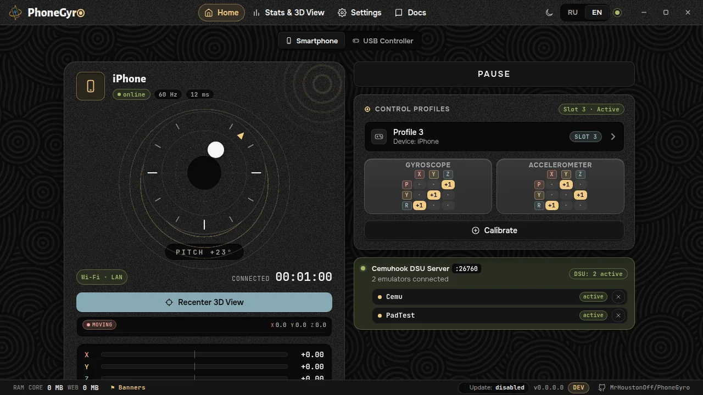

# Quick start

> [!IMPORTANT]
> Read this page to the end, it takes two minutes. Almost every problem with PhoneGyro comes down to what is described here: an uncalibrated device, the wrong profile, or the wrong grip.

## Preparing the phone

First the phone has to trust the computer. Browsers only expose gyroscope data over a secure connection, so PhoneGyro uses its own certificate. What you need to do depends on the phone.

### Android

Nothing to set up. Scan the QR code on the PhoneGyro main screen and Chrome shows a "Your connection is not private" warning. Tap **Advanced → Proceed to ... (unsafe)**. This is normal for local addresses and does not affect the app.

Chrome remembers the decision, but the warning can come back, for example after the computer's IP changes. Each time, repeat the same two taps. When exactly it returns is described in [Certificates and TLS](tls.en.md).

### iPhone and iPad

This one is harder: Safari will not accept the connection until you install the certificate and turn on trust for it. You do it once.

1. In PhoneGyro open the **Initial Setup** tab in the window header.
2. Pick iOS and go through the six steps: download the profile, install it, and enable trust in **Settings → General → About → Certificate Trust Settings**.
3. Then scan the QR code on the main screen, as on Android.

The certificate is created on your PC and never sent anywhere. How it works, where it lives and how to remove it is in [Certificates and TLS](tls.en.md). If you do not trust it, the code that issues it is open: [`pkg/ca/ca.go`](https://github.com/MrHoustonOff/PhoneGyro/blob/main/pkg/ca/ca.go).

> [!NOTE]
> A USB controller needs no certificates. See [USB controller](usb.en.md).

## Setup

### Touch Shield

On the phone, always tap the **Touch Shield** button in the top bar of the page. The screen will not go dark, and stray touches will not break anything. If the screen does turn off, the phone stops sending data. To exit, **hold** the big button for 4 seconds.

### Calibration

Tap **Calibrate** on the main screen and go through the wizard: four recording steps and a check.

Technically a device and grip only need calibrating once. In practice things happen: if you notice any problem at all, ***calibrate again first***.

> [!IMPORTANT]
> Calibration is the most important step. Without it PhoneGyro does not know where "forward" and "right" are for your device, and the aim in the game moves the wrong way.

### Grip and profile name

PhoneGyro does not care how you hold the phone. Hold it however is comfortable, but calibrate in that very grip and name the profile so you do not forget which grip it is ("Clipped to the gamepad", "Two hands"). Changed your grip? Pick another profile or create a new one.

### Recenter 3D View

> [!WARNING]
> The **Recenter 3D View** button does not change the data sent to the game in any way. It only improves the picture inside PhoneGyro. Do not try to "fix" the aim with it, that is what calibration is for.

## Check

Once the profile is calibrated you can play: set up your emulator as described in [Emulator setup](emulators.en.md). We still recommend checking everything in [PadTest](https://files.sshnuke.net/PadTest_1011.zip) first: it shows at once how the device behaves.

## If something is wrong

All three symptoms have one cure:

1. Something is off with the controller or the phone.
2. The device behaves strangely.
3. The device moves too fast or too much.

***Calibrate again.*** Calibration is the most important part. For everything else see [Troubleshooting](troubleshooting.en.md).

## Play with the app minimized

> [!IMPORTANT]
> ***KEEP PHONEGYRO IN THE TRAY WHILE YOU PLAY.*** It cuts the load on your computer roughly 4 times. The gyro keeps working.

Click the minimize button and choose **Hide to tray**. Bring the window back from the PhoneGyro tray icon. Details: [Tray and memory](tray.en.md).

## In four steps

1. Take your phone.
2. Scan the QR code (on iPhone, go through "Initial Setup" first).
3. Calibrate the device, once.
4. Play.

Read the next pages for more on each part of the app.
