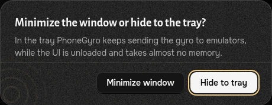

# Трей и память

> [!IMPORTANT]
> ***Играя, держите PhoneGyro в трее.*** Гироскоп при этом работает как обычно, а компьютер получает заметно меньше нагрузки.

## Как свернуть в трей

Кнопка **«свернуть»** в заголовке окна ***всегда спрашивает***, что сделать: свернуть окно или убрать его в трей.

* **Свернуть окно** — обычное сворачивание на панель задач. Интерфейс остаётся в памяти.
* **Свернуть в трей** — окно скрывается, значок PhoneGyro остаётся в области уведомлений.

То же происходит с кнопкой закрытия (крестик). В [Настройках](settings.ru.md) пункт **«Действие при закрытии»** задаёт, что делать: спрашивать каждый раз, сворачивать в трей или закрывать приложение полностью. В окне вопроса можно отметить **«Запомнить мой выбор»**.

## Что происходит в трее

* ***Гироскоп работает дальше.*** DSU-сервер, связь с телефоном и USB-контроллером, контроль потери связи продолжают работать так же, как при открытом окне.
* **Интерфейс выгружается.** Через пару секунд после скрытия окна страница заменяется пустой: в памяти не остаётся ни интерфейса, ни 3D.
* **WebView2 переходит в режим эффективности.** Это тот самый зелёный листик в Диспетчере задач: низкий приоритет и экономия энергии.
* **Память резко падает.** PhoneGyro возвращает Windows всё, без чего может обойтись.

Работа DSU и телефонной связи при этом не замедляется: режим эффективности касается только процессов окна.

> [!WARNING]
> Не сворачивайте приложение в трей посреди калибровки: интерфейс выгрузится, и незавершённая запись будет сброшена.

## Вернуть окно

Дважды щёлкните значок PhoneGyro в трее или выберите **Открыть PhoneGyro** в его меню. Интерфейс загрузится заново, заставка при этом пропускается.

## Меню трея

Правый щелчок по значку:

| Пункт | Что показывает или делает |
|---|---|
| **Открыть PhoneGyro** | Возвращает окно. |
| Устройство | Имя устройства и статус: онлайн, пауза или ожидание подключения. |
| **Эмуляторы** | Имена программ, которые сейчас подключены к DSU-серверу. |
| Профиль | Активный профиль управления. |
| **Пауза / Продолжить** | Ставит передачу движения на паузу и снимает её. Пункт виден, пока устройство онлайн. |
| **Выход** | Полностью закрывает PhoneGyro. |

## Память в подвале окна

Внизу окна показано **ОЗУ** двумя числами:

* ***CORE*** — сам PhoneGyro (программа на Go): сервер, обработка движения, DSU.
* ***WEB*** — окно интерфейса, то есть движок **WebView2**, встроенный в Windows.

Почти вся память уходит на WEB: это обычный браузерный движок с 3D и графиками. Поэтому, пока вы играете, окно лучше держать в трее: тогда WEB исчезает, а CORE остаётся.
