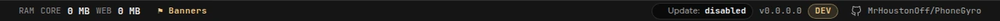

# Updates

PhoneGyro ***does not update itself***. It can only tell you a new version is out; downloading and replacing the file is up to you.

## Update check

The check is ***off by default***. Turn it on in [Settings](settings.en.md): **Check for updates at startup**.

> [!NOTE]
> This is ***the only internet request PhoneGyro makes***. While it is off, the program is fully offline. Nothing about you is sent: the app only asks GitHub for the latest version number.

With the check on, PhoneGyro asks GitHub shortly after launch and then every few hours. If a check fails, it is retried with a growing delay.

## Status in the footer

The bottom right of the window shows the check status, the version and the build channel.

| Status | Meaning |
|---|---|
| disabled | The check is off. Clicking opens settings. |
| checking… | A request to GitHub is in progress. |
| up to date | You have the latest version. Clicking re-checks. |
| v2.x.x available | A new version is out. Clicking opens the release page. |
| failed | The check could not be done. Clicking retries. |

## When a new version is out

A window appears with the version numbers and a link to the release page with the changes. Its buttons are **Download**, **Later** and the **Don't remind me about this version** checkbox. A newer version shows the window again.

## How to update

1. Download the new `PhoneGyro.exe`.
2. Run only that one from now on. The old file can be deleted.

***Settings and profiles are kept***: they live in the [data folder](data.en.md), not next to the exe. The iPhone certificate is kept as well, there is no need to reinstall it except in the cases listed in [Certificates and TLS](tls.en.md).

## Build channels

A build number looks like `2.0.2.017-dev`: the release version, the number of commits on top of it and the channel. The footer shows a channel badge next to the version:

* ***release*** is a build of an exact release tag, what you download from the releases page;
* ***dev*** is a build from the development branch between releases and may be unstable.

The update check compares your version with the ***latest published release*** on GitHub, not with dev builds.
